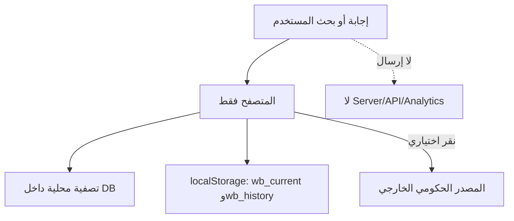

# PRE-LAUNCH TECHNICAL & COMMERCIAL QA

تاريخ الفحص: 2026-09-23  
HEAD الابتدائي: `06fc97c6682f86e1fb72782fd98ed9b4f5120ce3`

الحالة القانونية لم تتغير:

**PRE-LEGAL REVIEW COMPLETE — AWAITING LICENSED SAUDI LAWYER APPROVAL**

لم تُعدّل Results أو Questions أو Options أو المواد أو المدد أو الرسوم أو الاختصاصات أو القرارات القانونية الـ59.

## النتيجة التنفيذية

| التصنيف | قبل | بعد | الحالة |
|---|---:|---:|---|
| BLOCKER | 0 | 0 | لا يوجد مانع تقني للبيع |
| HIGH | 2 | 0 | FIXED |
| MEDIUM | 3 | 0 | FIXED |
| LOW | 8 | 2 | 6 FIXED، و2 تحسينان اختياريان |

## المشكلات التي أصلحت

| ID | الخطورة | المشكلة | المعالجة |
|---|---|---|---|
| H-01 | HIGH | تسجيل مستمع Back/Forward خمس مرات | أصبح مستمعًا واحدًا فقط |
| H-02 | HIGH | البحث لا يدخل مجموعات العبارات العميقة في المرشحين؛ فشل «نفاذ ما يفتح» وضلل «رخصه بلدي» | دمج Search Aliases ومجموعات العبارات مع أولوية للتطابق الكامل |
| M-01 | MEDIUM | قراءة `localStorage` في لوحة التحكم دون حماية عند منعه | أضيف fallback آمن دون تعطيل التطبيق |
| M-02 | MEDIUM | Safe Area الأفقي يستهدف `.wrap` غير الموجودة | أصبح يستهدف `.app` الفعلية |
| M-03 | MEDIUM | رابط المصدر موثوق من DB لكنه بلا تحقق بروتوكول وقت العرض | لا يعرض إلا رابط HTTPS صالحًا |
| L-01 | LOW | زر استكمال المسار 43px | أصبح 44px |
| L-02 | LOW | الرموز فقط تنتج حالة صامتة | أضيفت رسالة إدخال واضحة |
| L-03 | LOW | البحث بلا حد طول | حد 500 حرف مع قص دفاعي في التطبيع |
| L-04 | LOW | SVG زخرفية قد تُقرأ بقارئ الشاشة | أصبحت `aria-hidden` و`focusable=false` |
| L-05 | LOW | رابط المصدر لا يوضح فتح نافذة جديدة لقارئ الشاشة | أضيف اسم وصول واضح |
| L-06 | LOW | النصوص الطويلة قد تضغط العرض | أضيف `overflow-wrap:anywhere` |

## الاختبارات

- 30 Customer Journeys موزعة على بوابات Q001 المختلفة.
- 376 تحققًا داخل الرحلات: اتصال المسار، الخيارات، السابق، الوصول للنتيجة، الإجراء، المصدر، وإعادة البداية.
- 39 عبارة بحث واقعية تشمل اللهجة، الهمزات، ي/ى، ة/ه، المسافات، الجهات، والمصطلحات العامة.
- إجمالي التحققات الآلية: 457.
- حالات الفشل: بدون نتائج، رموز خاصة، إدخال طويل، تخزين فارغ/تالف/محجوب، Refresh، Back/Forward، Offline غير المدعوم، والنتائج ذات الحقول الاختيارية الفارغة.

ملف النتائج التفصيلي: `docs/pre-launch/pre-launch-technical-qa.json`.

## Mobile First

تم فحص قواعد العرض للمقاسات:

- 320×568
- 390×844
- 393×852
- 430×932

النتيجة البنيوية: **PASS** — RTL، breakpoints، Safe Area، touch targets، overflow، البحث، القطاعات، الأسئلة، النتائج والتفاصيل.

اختبار Safari/VoiceOver الحقيقي: **HUMAN DEVICE TEST REQUIRED** في `docs/pre-launch/HUMAN_IPHONE_TEST.md`.

## Desktop

فُحصت ملفات CSS لمساحات 1366×768 و1440×900 و1920×1080، واختبرت النسخة المنشورة فعليًا في Chrome بعرض 1363px. الحد الأقصى للمحتوى 820px ويحافظ على قابلية القراءة.

النتيجة: **PASS**.

## Search

النتيجة: **PASS** بعد الإصلاح. من الحالات المؤكدة:

- «نفاذ ما يفتح» → Q300
- «توكلنا ما يشتغل» → Q300
- «رخصه بلدي» → Q308
- «توثيق متجر الكتروني» → Q309
- «هويتي ضاعت» → Q294
- «شركة نصبت علي» → Q080

الانتقال يبقى إلى سؤال تشخيصي ولا يقفز إلى حكم قانوني جديد.

## Performance

- `index.html`: نحو 5.4MB غير مضغوط.
- الحجم التجريبي عند gzip: نحو 565KB.
- لا توجد مكتبات أو JavaScript أو خطوط خارجية.
- أكبر كلفة: قاعدة الـ646 Result المضمنة داخل الملف الأحادي.
- البحث والرحلات يعملان محليًا دون طلب شبكة إضافي.

النتيجة: **PASS مع تحسين اختياري**. فصل البيانات لاحقًا قد يحسن parsing والصيانة، لكنه تغيير معماري غير مناسب قبل اعتماد المحامي.

## Service Worker / Cache

- ملف Service Worker موجود لكنه غير مسجل في التطبيق الحالي.
- لذلك لا توجد نسخة HTML قديمة محتجزة في Cache Storage بواسطة التطبيق.
- GitHub Pages يضع Cache للـHTML لمدة تقارب 600 ثانية؛ بعد النشر قد يستغرق الانتشار عدة دقائق.
- Offline غير معلن وغير مدعوم حاليًا.
- ملف Service Worker، إن سُجل مستقبلًا، يستخدم network-only مع `no-store` للتنقل ويحذف أسماء الكاش القديمة عند التفعيل.

النتيجة: **PASS** من ناحية منع نسخة قانونية قديمة داخل Service Worker. Offline: **NOT SUPPORTED**.

## Security

- XSS: قيم DB تمر عبر `esc`، ومدخل البحث لا يُحقن في HTML.
- المصادر لا تعرض إلا HTTPS صالحًا.
- `target="_blank"` يستخدم `noopener noreferrer`.
- External scripts/dependencies: 0.
- API keys/tokens/secrets: 0.
- Mixed content في Sources: 0.
- CSP وReferrer Policy موجودتان.
- `unsafe-inline` باقية بسبب بنية الملف الأحادي؛ إزالتها تتطلب فصل CSS/JS.

النتيجة: **PASS**.

## Privacy Data Flow

- Cookies: لا توجد.
- Analytics/Trackers: لا توجد.
- Forms أو حسابات: لا توجد.
- Search terms: لا تُحفظ ولا تُرسل إلى خادم المنتج.
- `localStorage`: معرف الحالة ومسار الرجوع فقط.
- CSP تمنع اتصالات التطبيق الشبكية (`connect-src 'none'`).
- عند فتح مصدر رسمي، يستقبل موقع الجهة اتصال المستخدم المعتاد؛ `Referrer-Policy: no-referrer` تمنع إرسال رابط الصفحة المرجعية.

النتيجة التقنية: **PASS**. سياسة الخصوصية التجارية النهائية تحتاج اعتمادًا مهنيًا وربطها بمتجر البيع الفعلي.

## Accessibility

- `lang="ar"` و`dir="rtl"`.
- main/header/section وعناوين مرتبة.
- Skip link.
- Label حقيقي للبحث.
- أزرار HTML أصلية وFocus ظاهر.
- Progress باسم وقيمة.
- التفاصيل عبر `details/summary`.
- نقل التركيز إلى عنوان الشاشة.
- العناصر الزخرفية مخفية عن قارئ الشاشة.

النتيجة البنيوية: **PASS**. VoiceOver الفعلي: **HUMAN DEVICE TEST REQUIRED**.

## Orphan Sources

- العدد: 317.
- التصنيف: **UNUSED / RESERVED**.
- لا يستخدمها أي Result حاليًا، ولم تُحذف أو تُغيّر.
- السجل: `docs/ORPHAN_SOURCES.csv`.

## Release Hygiene

ملفات التشغيل الحالية: `index.html`، نسخة البيع المطابقة، manifest، icon، وService Worker غير المسجل. بقيت النسخ التاريخية محفوظة كنقاط رجوع ولم تُحذف. أرشفتها في Release/Tag لاحقًا تحسين اختياري بعد قرار المالك.

## المتبقي

### HUMAN TEST REQUIRED

- Safari/iPhone بالمقاسات المحددة.
- VoiceOver وتكبير النص 200%.
- لوحة المفاتيح، الدوران، Private Browsing، والعودة من الرابط الخارجي.

### LAWYER REQUIRED

- اعتماد القرارات القانونية الـ59.
- اعتماد شروط الاستخدام، إخلاء المسؤولية، الخصوصية، الترخيص، وسياسة الاسترداد.

### TAX/ACCOUNTING REQUIRED

- صفة البائع والمنشأة.
- التسجيل والفوترة وضريبة القيمة المضافة حسب حجم ونموذج النشاط.
- معالجة رسوم بوابة الدفع، الاستردادات، والاشتراكات إن وجدت.

### OPTIONAL FUTURE IMPROVEMENT

1. فصل DB/CSS/JS بعد الاعتماد مع اختبار تطابق كامل.
2. أرشفة النسخ التاريخية بعد إنشاء Tag/Release قابل للاستعادة.
